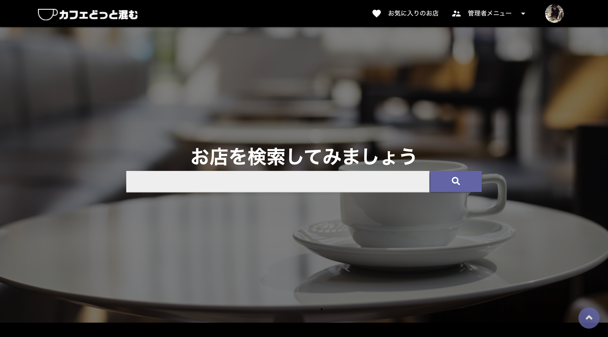

# カフェどっと混む

## 概要

- せっかく入ったカフェが満席だった...
- 今すぐ入れるカフェが知りたい
- カフェの口コミが知りたい

そんな方のために「カフェどっと混む」を製作しました。
もうカフェ難民にはしません。

## URL

https://cafedotcom.jp/

## 使用技術

### バックエンド

- Ruby 2.6.5
- Rails 5.2.4

### フロントエンド

- HTML5 + CSS3 + JavaScript
- jQuery
- Sass
- Materialize

### データベース

- PostgreSQL 11.5

### インフラ環境

- Nginx
- Unicorn
- Docker
- Docker Compose
- AWS（VPC、EC2、RDS、ELB、Route53、ACM、S3）

### CI/CD

- GitHub
- Capistrano
- CircleCI

### 外部 API

- Google Maps API
- ぐるなび API

## アプリケーション構成図

## 機能一覧

### ログイン機能

- ログイン／ログアウト機能（Twitter アカウントによるログイン可）
- サインアップ機能

### ユーザー情報管理機能

- ユーザー情報一覧／詳細／編集／削除

### 店舗情報情報管理機能

- 店舗情報一覧／詳細／編集／削除
- お気に入り登録機能

### 店舗情報検索機能

- キーワード検索
- 今空いているお店
- 近くのお店
- 電源があるお店
- Wi-Fi があるお店

### リアルタイム表示機能

- ランキング別表示機能
- 新着コメント表示機能

### コメント機能

- コメント（お店の混雑状況／満足度）登録
- いいね登録
- SNS シェア
